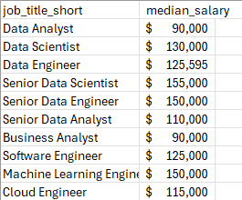
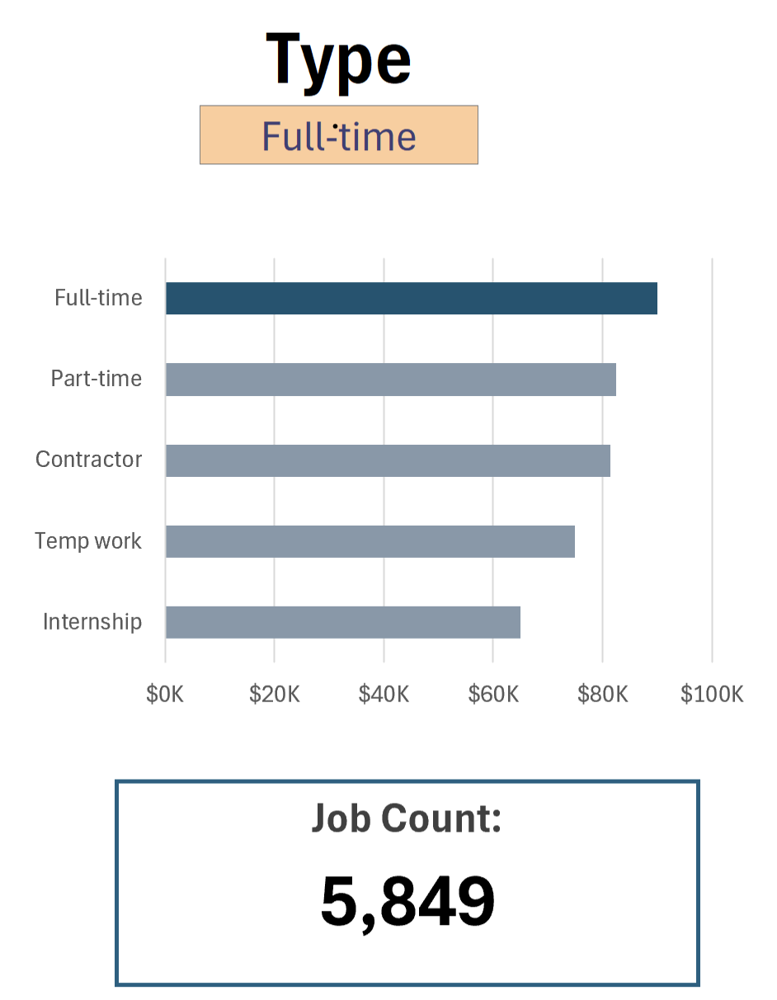

# Salary Dashboard


# Introduction
This Excel dashboard provides an interactive way to explore salaries for various data-related jobs. It’s designed to help job seekers and professionals understand compensation trends for different roles, locations, and employment types.

The dataset contains comprehensive information about job titles, salary ranges, locations, and essential skills, which are analyzed and visualized in this dashboard.

### My Dashboard File
You can access the completed dashboard here: [Dashboard_1.xlsx](Dashboard_1.xlsx)

### Excel Skills Demonstrated

This project highlights the following Excel techniques:

- **Data Validation-** ensure accurate and consistent inputs.
- **Formulas & Functions-** perform calculations and data analysis.
- **Charts-** For visual representation.

### Dataset 
The dataset used for this project includes real-world 2023 data on data jobs, covering:

- **Job titles**
- **Salaries**
- **Locations**
- **Skills**

The dataset is available via [Luke Barousse's Excel course](https://www.lukebarousse.com/excel), which provides a foundation for analyzing data using Excel.

## Dashboard Components

### Charts:

#### 1. Salary Comparison by Job Title (Bar Chart)


- **Excel Features:** Bar chart with formatted salary values and clear layout.
- **Design Choice:** Horizontal bars make it easy to compare median salaries.
- **Data Insights:** Quickly identify high-paying roles; senior-level and engineering positions generally offer higher salaries than analyst roles.

#### 2. Global Median Salaries Overview (Map Chart)


- **Excel Features:** Map chart to display median salaries by country.
- **Design Choice:** Color-coded regions for intuitive understanding of salary levels.
- **Data Insights:** Highlights global disparities and shows which countries offer higher or lower median salaries.

#### 3. Salary Distribution by Employment Type (Bar Chart)


- **Excel Features:** Bar chart with formatted salary values and and optimized layout for clarity.
- **Design Choice:** Horizontal layout allows easy comparison of median salaries across employment types.
- **Data Insights:** Full-time roles generally offer higher salaries.

### Key Formulas & Functions:

#### 1. Median Salary by Job Titles

```
=MEDIAN(
IF(
    (jobs[job_title_short]=A2)*
    (jobs[job_country]=country)*
    (ISNUMBER(SEARCH(type,jobs[job_schedule_type])))*
    (jobs[salary_year_avg]<>0),
    jobs[salary_year_avg]
)
)
```

- **Dynamic Filtering Logic:** Applies condition for job title, country, and schedule type, while omitting entries with missing salary data.
- **Array-Based Calculation:** Leverages the `MEDIAN()` function nested within `IF()` statements to analyze an array.
- **Contextual Insights:** Delivers salary figures tailored to specific roles, geographies, and schedule types.
- **Formula Functionality:** This formula calculates and displays the median salary in the table below, filtered by job title, country, and employment type.

Background Table:



Dashboard Implementation:


#### 2. Count of Job Schedule Type

```
=FILTER(J2#,(NOT(ISNUMBER(SEARCH("and",J2#))+ISNUMBER(SEARCH(",",J2#))))*(J2#<>0))
```

- **Filtered List Creation:** Uses the `FILTER()` function to remove entries with "and", commas, or zero values for cleaner results.
- **Formula Role:** Generates a refined list of distinct job schedule types, displayed in the table below.

Background Table:


Dashboard Implementation:



### Data Validation:
- **Robust Data Validation:** The filtered list is applied as a validation rule for `Job Title`, `Country`, and `Type` fields via the Data tab, ensuring:
    - Inputs are limited to  predefined, pre-approved schedule types
    - Prevents incorrect entries
    - Dashboard usability and data integrity are significantly improved

## Conclusion

This Excel dashboard offers a clear, interactive way to explore salaries for data-related roles. By visualizing data through charts, maps, and dynamic tables, users can quickly understand how job title, location, and employment type impact salaries.

It’s a practical tool for anyone planning their career or negotiating compensation, and it demonstrates advanced Excel skills including formulas, charting, and data validation.
