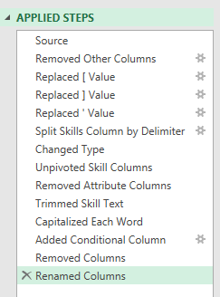

# Project 2 – Job Market Analysis

## Introduction
While exploring opportunities in the data job market, I noticed a lack of accessible insights into which jobs and skills are the most rewarding. This project was my attempt to analyze job postings and better understand which skills employers value most and how they relate to salary levels.

### Key Questions

To guide my analysis, I focused on these questions:

1. **Does having more skills lead to higher pay?**
2. **How do salaries for data jobs vary by region?**
3. **Which are the top skills among data professionals?**
4. **What are the salary trends for the top 10 skills?**

### Excel Tools & Features

For this project, I worked with a variety of Excel tools, including:

- **PivotTables**
- **PivotCharts**
- **DAX (Data Analysis Expressions)**
- **Power Query**
- **Power Pivot**

### Dataset 
The dataset used for this project includes real-world 2023 data on data jobs, covering:

- **Job titles**
- **Salaries**
- **Locations**
- **Skills**

The dataset is available via [Luke Barousse's Excel course](https://www.lukebarousse.com/excel), which provides a foundation for analyzing data using Excel.

---

## 1️. Do more skills lead to better pay?

### Skill: Power Query (ETL)

#### Extract

I began by importing the dataset (`data_jobs_salary_all.xlsx`) into Power Query and built two queries:
- **All Jobs Data** – First one with all the data jobs information.
- **Job Skills Data** – listing the skills required for each job ID.

#### Transform

I then cleaned and transformed the queries by updating column types, removing unnecessary fields, standardizing text, and trimming whitespace.
- data_jobs_all


- data_job_skills



#### Load

Finally, I loaded the transformed queries back into the workbook, providing a clean dataset for analysis.
- data_jobs_all


- data_job_skills


### Analysis & Insights

- Jobs with more listed skills generally pay higher salaries, particularly for roles such as Data Scientist and Senior Data Engineer.
-  Positions that require fewer skills, like Business Analyst, tend to fall into lower salary ranges, indicating that more specialized skill sets command higher market value.


**Implications:** The trend showcases that developing multiple in-demand skills can significantly boost earning potential in data roles.

---

## 2️. How do salaries for data jobs vary by region?

### Skills: PivotTables & DAX

#### Pivot Table
- I created a PivotTable using the Data Model I created with Power Pivot.
- I moved the `job_title_short` to the rows area and `salary_year_avg` into the values area.
- Then I added new measure to calculate the median salary for United States jobs.

To calculate for US-only roles:

```
=CALCULATE(
    MEDIAN(data_jobs_all[salary_year_avg]),
    data_jobs_all[job_country] = "United States"
)
```

#### Dax
- I used **DAX measures** to calculate median salaries.
```
Median Salary := MEDIAN(data_jobs_all[salary_year_avg])
```

### Analysis & Insights

- Senior roles (e.g., Data Scientist, Data Engineer) command higher pay both in the US and globally.
- High-tech roles often exhibit a pronounced salary gap between US and non-US positions, likely driven by the dense concentration of tech industries within the United States.


**Implications:** Understanding salary trends is essential for informed planning and negotiation. These insights help professionals and employers align compensation with market standards, while accounting for geographic differences that influence pay scales.

---

## 3️. What are the most in-demand skills of data professionals?

### Skill: Power Pivot

#### Power Pivot
- Using **Power Pivot**, I built a data model linking `data_jobs_all` and `data_jobs_skills` tables into one model. Since I had already cleaned the data using Power Query; Power Pivot created a relationship between these two tables.

#### Data Model
- Via the `job_id` field, I created a relationship between my two tables.
 


#### Power Pivot Menu
- Using the Power Pivot menu, I enhanced the data model which supports efficient measure creation.


### Analysis & Insights

- SQL and Python are the most frequently requested skills in data-related positions.
- Cloud technologies like AWS and Azure also appear strongly, reflecting the shift toward big data and cloud adoption.


**Implications:** Mapping prevalent industry skills not only helps professionals stay ahead of the curve, but also informs training and education initiatives to focus on technologies with the greatest impact.

---

## 4️. How much do the top 10 skills pay?

### Skill: PivotCharts

#### PivotChart
- I built a combo PivotChart to show both:
- **Median Salary (Clustered Column – primary axis)**
- **Skill Count (Line with Markers – secondary axis)**

### Analysis & Insights

- Generally, high-value skills like Python, and SQL are strongly associated with better salaries.
- Skills such as Word and PowerPoint align with lower-paying roles and count, suggesting limited specialization and lower relevance in high-paying sectors. 


**Implications:** Focusing on technical skills like Python and SQL can unlock higher-paying opportunities, while general productivity tools add limited salary value. For professionals aiming to optimize their earning potential in tech, prioritizing these in-demand competencies is a strategic investment.

---

## Conclusion

What began as a personal quest to understand the data job market soon evolved into a hands-on exploration of industry trends, skill demand, and salary dynamics. This Excel-based analysis reflects my journey as a data enthusiast navigating the job market with curiosity and intent. By curating and exploring real-world job postings, I examined job titles, salaries, locations, and essential skills. With tools like Power Query, PivotTables, DAX, and dynamic charts, I transformed raw listings into meaningful insights. Patterns emerged: Python and SQL consistently stood out as high-value skills, while cloud technologies like AWS and Azure marked a clear shift toward scalable data infrastructure.

This project became more than just an analysis, it became a reflection of my learning journey. Each chart, filter, and formula was a step toward clarity, helping me and hopefully others, navigate the evolving landscape of data careers. For professionals aiming to grow or pivot, I hope this serves as both a guide and a reminder: the right skills, backed by the right insights, can open powerful doors.

---
