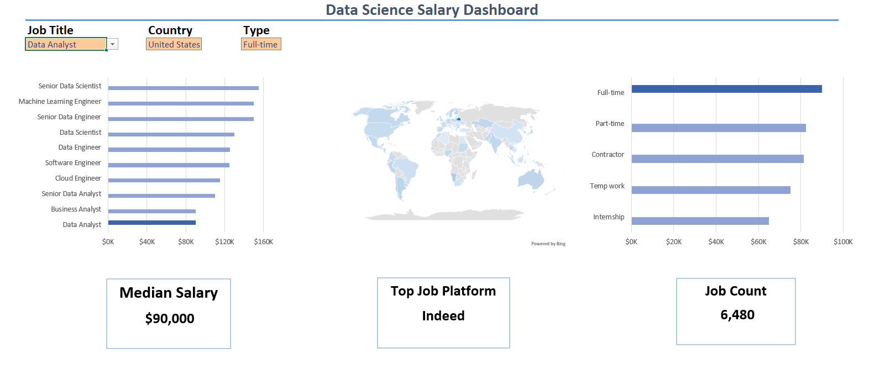
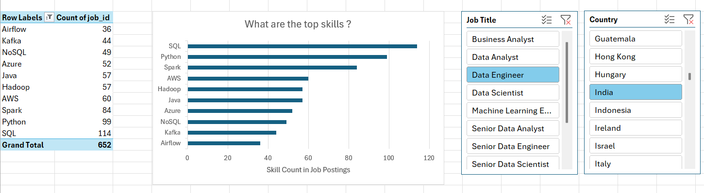
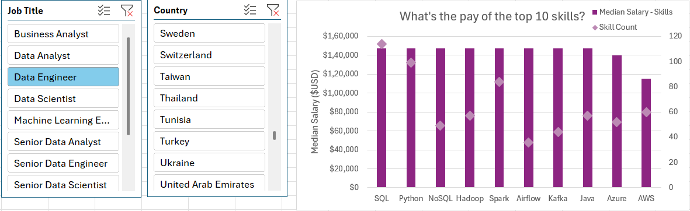

# My Data Analytics Projects Developed in Excel
 Hello! Here's a collection of hands-on projects where I applied data analytics techniques using Excel, transforming raw data to actionable insights.

## Salary Dashboard
This Excel-based salary dashboard empowers job seekers to explore compensation trends across data roles, helping them make informed career decisions and benchmark their expected salaries with confidence.
[Explore my work here](Dashboard_Project_1)

## Final Analysis
While exploring the job market, I realized there wasn’t much data on which roles and skills truly mattered in data industry. Curious, I set out to uncover the skills top employers demand, the roles that are most rewarding, and how one can strategically build a career to land higher pay.
[Explore my work here](Final_Project)

